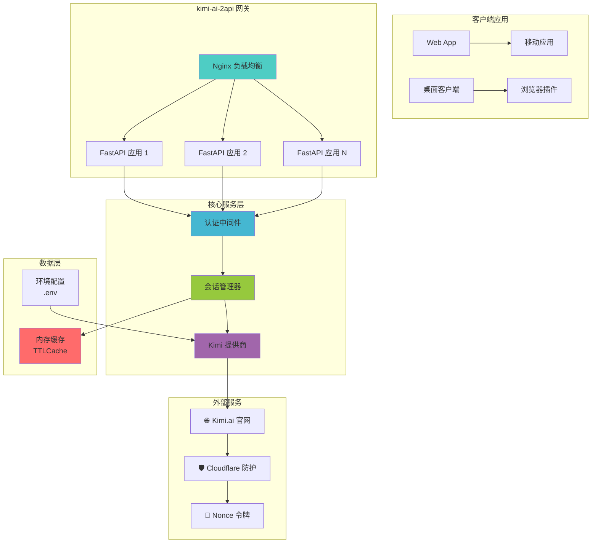

# 🚀 kimi-ai-2api: 你的 Kimi AI "万能转换插头" 🚀

<div align="center">
  <strong>一个将 Kimi.ai 聊天体验无缝转换为兼容 OpenAI API 格式的高性能代理服务</strong>
  
  <p>
    <em>"我们不创造 AI，我们只是 AI 世界的'连接者'，让强大的力量以更熟悉、更便捷的方式流淌到你的指尖。"</em>
  </p>

  <div>
    <a href="https://github.com/lzA6/kimi-ai-2api/blob/main/LICENSE">
      
    </a>
    <a href="https://github.com/lzA6/kimi-ai-2api/stargazers">
      
    </a>
    <a href="https://github.com/lzA6/kimi-ai-2api/forks">
      
    </a>
    <a href="https://hub.docker.com/r/your-docker-repo/kimi-ai-2api">
      
    </a>
  </div>

  <br>
  
  <div>
    <a href="#-快速开始" style="text-decoration: none;">
      <button style="background: linear-gradient(45deg, #FF6B6B, #4ECDC4); border: none; padding: 12px 24px; border-radius: 8px; color: white; font-weight: bold; cursor: pointer; margin: 5px;">
        🚀 快速开始
      </button>
    </a>
    <a href="#-docker-部署" style="text-decoration: none;">
      <button style="background: linear-gradient(45deg, #45B7D1, #96C93D); border: none; padding: 12px 24px; border-radius: 8px; color: white; font-weight: bold; cursor: pointer; margin: 5px;">
        🐳 Docker 部署
      </button>
    </a>
    <a href="#-技术架构" style="text-decoration: none;">
      <button style="background: linear-gradient(45deg, #A166AB, #5073B8); border: none; padding: 12px 24px; border-radius: 8px; color: white; font-weight: bold; cursor: pointer; margin: 5px;">
        🏗️ 技术架构
      </button>
    </a>
  </div>
</div>

---

## 📖 目录导航

- [🌟 核心哲学](#-核心哲学)
- [✨ 主要特性](#-主要特性)
- [🏗️ 技术架构](#-技术架构)
- [🚀 快速开始](#-快速开始)
- [🐳 Docker 部署](#-docker-部署)
- [🔧 配置说明](#-配置说明)
- [💡 使用示例](#-使用示例)
- [🛠️ 开发指南](#️-开发指南)
- [📈 项目路线图](#-项目路线图)
- [🤝 参与贡献](#-参与贡献)
- [📜 开源协议](#-开源协议)

---

## 🌟 核心哲学

在这个 AI 技术飞速发展的时代，我们站在技术浪潮的前沿，渴望拥抱每一个强大的 AI 能力。然而，不同的 AI 服务之间往往存在着技术壁垒，让开发者难以充分利用各种 AI 的优势。

`kimi-ai-2api` 的诞生源于一个简单而强大的愿景：**打破技术壁垒，建立无缝连接**。

### 我们的信念：

- **开放共享** - 打破封闭生态，让优秀的技术能够自由流动
- **赋能开发** - 让你喜爱的工具和应用都能轻松集成 Kimi AI 能力
- **激发创造** - 当技术不再成为障碍，创造力将无限释放

> 这个项目是对所有开发者和创造者的致敬。它传递着一个信念：**"只要有想法，技术不应是障碍。你来，你也能行！"**

---

## ✨ 主要特性

<div align="center">

| 特性 | 描述 | 状态 |
|------|------|------|
| 🔌 **OpenAI 兼容** | 即插即用，完美兼容 OpenAI API 格式 | ✅ 已实现 |
| 🧠 **智能会话管理** | 支持有状态和无状态两种会话模式 | ✅ 已实现 |
| 💨 **流式响应** | 伪流式响应，提供流畅的交互体验 | ✅ 已实现 |
| 🐳 **容器化部署** | Docker 一键部署，简化运维 | ✅ 已实现 |
| 🔐 **安全认证** | API 密钥认证，保护服务安全 | ✅ 已实现 |
| 🔄 **智能重试** | 自动处理令牌刷新和请求重试 | ✅ 已实现 |
| 📊 **会话持久化** | 可配置的会话缓存和 TTL 管理 | ✅ 已实现 |

</div>

### 🎯 核心功能详解

#### 🔌 OpenAI 完全兼容
- 支持标准的 `v1/chat/completions` 和 `v1/models` 端点
- 兼容所有基于 OpenAI SDK 的客户端和库
- 无缝替换现有应用中的 OpenAI 配置

#### 🧠 智能会话管理
```python
# 有状态会话 - 记住对话历史
{
  "model": "kimi",
  "messages": [...],
  "user": "user_123456"  # 唯一用户ID，开启会话记忆
}

# 无状态会话 - 单次请求
{
  "model": "kimi", 
  "messages": [...]
  # 无 user 字段，每次都是新对话
}
```

#### 💨 流畅的交互体验
- 伪流式响应模拟逐字输出效果
- 支持 Server-Sent Events (SSE) 协议
- 显著提升前端用户体验

---

## 🏗️ 技术架构

### 📐 系统架构图



### 📁 项目结构

```
kimi-ai-2api/
├── 🐳 部署配置
│   ├── docker-compose.yml          # 🏗️ 容器编排
│   ├── Dockerfile                  # 📦 容器构建
│   └── nginx.conf                  # 🚦 反向代理
├── 🔧 应用核心
│   ├── main.py                     # 🚪 应用入口
│   ├── requirements.txt            # 📋 依赖管理
│   └── app/
│       ├── core/
│       │   ├── config.py           # ⚙️ 配置管理
│       │   └── __init__.py
│       ├── providers/
│       │   ├── base_provider.py    # 🏛️ 提供商基类
│       │   ├── kimi_ai_provider.py # 🧠 Kimi 核心逻辑
│       │   └── __init__.py
│       └── utils/
│           └── sse_utils.py        # 📨 SSE 工具类
├── 🔐 环境配置
│   ├── .env.example                # 🎨 配置模板
│   └── .env                        # 🔒 实际配置
└── 📚 文档资源
    ├── README.md                   # 📖 项目说明
    └── assets/                     # 🖼️ 资源文件
```

### 🛠️ 技术栈详情

<div align="center">

| 层级 | 技术选型 | 版本 | 选择理由 |
|------|----------|------|----------|
| **容器化** | Docker + Docker Compose | latest | 环境隔离，一键部署 |
| **代理层** | Nginx | 1.18+ | 高性能负载均衡 |
| **应用框架** | FastAPI + Uvicorn | 0.104+ | 异步高性能，自动文档 |
| **HTTP 客户端** | Cloudscraper | 1.2.71+ | 绕过 Cloudflare 防护 |
| **数据验证** | Pydantic | 2.5+ | 类型安全，性能优异 |
| **缓存管理** | TTLCache | 内置 | 轻量级内存缓存 |

</div>

---

## 🚀 快速开始

### 环境要求

- 🐳 **Docker** 20.10+
- 🐙 **Docker Compose** 2.0+
- 💻 **操作系统**: Linux, macOS, Windows (WSL2)

### 5分钟快速部署

#### 1. 克隆项目
```bash
git clone https://github.com/lzA6/kimi-ai-2api.git
cd kimi-ai-2api
```

#### 2. 配置环境
```bash
# 复制配置模板
cp .env.example .env

# 编辑配置文件
nano .env  # 或使用你喜欢的编辑器
```

#### 3. 启动服务
```bash
# 一键启动所有服务
docker-compose up -d

# 查看服务状态
docker-compose ps

# 查看实时日志
docker-compose logs -f
```

#### 4. 验证部署
```bash
# 测试服务健康状态
curl http://localhost:8088/health

# 测试模型列表接口
curl -H "Authorization: Bearer your-api-key" \
  http://localhost:8088/v1/models
```

---

## 🐳 Docker 部署

### 单机部署

```yaml
# docker-compose.yml 核心配置
version: '3.8'

services:
  kimi-api:
    build: .
    container_name: kimi-ai-2api
    env_file:
      - .env
    environment:
      - API_MASTER_KEY=${API_MASTER_KEY}
      - SESSION_CACHE_TTL=${SESSION_CACHE_TTL:-3600}
    restart: unless-stopped
    healthcheck:
      test: ["CMD", "curl", "-f", "http://localhost:8000/health"]
      interval: 30s
      timeout: 10s
      retries: 3

  nginx:
    image: nginx:alpine
    container_name: kimi-nginx
    ports:
      - "${NGINX_PORT:-8088}:80"
    volumes:
      - ./nginx.conf:/etc/nginx/nginx.conf
    depends_on:
      - kimi-api
    restart: unless-stopped
```

### 生产环境部署建议

```bash
# 使用生产配置
docker-compose -f docker-compose.prod.yml up -d

# 设置资源限制
docker-compose --compatibility up -d

# 使用外部网络
docker network create kimi-network
docker-compose up -d
```

---

## 🔧 配置说明

### 环境变量配置

创建 `.env` 文件并配置以下参数：

```env
# ====================
# 🔐 安全配置 (必需)
# ====================
API_MASTER_KEY=sk-your-secret-key-here-2024

# ====================
# 🌐 网络配置 (可选)
# ====================
NGINX_PORT=8088
API_HOST=0.0.0.0
API_PORT=8000

# ====================
# 💾 会话配置 (可选)  
# ====================
SESSION_CACHE_TTL=3600
MAX_SESSION_SIZE=1000

# ====================
# 🔧 高级配置 (可选)
# ====================
LOG_LEVEL=INFO
REQUEST_TIMEOUT=60
MAX_RETRIES=3
```

### 配置参数详解

| 参数 | 默认值 | 说明 |
|------|--------|------|
| `API_MASTER_KEY` | 无 | **必须修改**，API 访问密钥 |
| `NGINX_PORT` | 8088 | 服务对外暴露端口 |
| `SESSION_CACHE_TTL` | 3600 | 会话缓存时间(秒) |
| `MAX_SESSION_SIZE` | 1000 | 最大会话缓存数量 |
| `LOG_LEVEL` | INFO | 日志级别 DEBUG/INFO/WARNING/ERROR |
| `REQUEST_TIMEOUT` | 60 | 请求超时时间(秒) |

---

## 💡 使用示例

### 基础聊天示例

```python
import openai

# 配置客户端
client = openai.OpenAI(
    base_url="http://localhost:8088/v1",
    api_key="sk-your-secret-key-here"
)

# 单次对话
response = client.chat.completions.create(
    model="kimi",
    messages=[
        {"role": "user", "content": "请用 Python 写一个快速排序算法"}
    ],
    stream=False
)

print(response.choices[0].message.content)
```

### 流式对话示例

```python
# 流式响应
stream = client.chat.completions.create(
    model="kimi",
    messages=[
        {"role": "user", "content": "解释一下量子计算的基本概念"}
    ],
    stream=True,
    user="user_123456"  # 开启会话记忆
)

for chunk in stream:
    if chunk.choices[0].delta.content:
        print(chunk.choices[0].delta.content, end="", flush=True)
```

### 会话记忆示例

```python
# 第一次对话 - 建立会话
response1 = client.chat.completions.create(
    model="kimi",
    messages=[
        {"role": "user", "content": "我叫张三，来自北京"}
    ],
    user="zhang_san_001"  # 使用用户ID开启会话记忆
)

# 第二次对话 - 记住上下文
response2 = client.chat.completions.create(
    model="kimi", 
    messages=[
        {"role": "user", "content": "我刚才说我来自哪里？"}
    ],
    user="zhang_san_001"  # 相同的用户ID，Kimi会记住之前的信息
)
```

### cURL 示例

```bash
# 获取模型列表
curl -H "Authorization: Bearer sk-your-key" \
  http://localhost:8088/v1/models

# 发送聊天请求
curl -X POST http://localhost:8088/v1/chat/completions \
  -H "Content-Type: application/json" \
  -H "Authorization: Bearer sk-your-key" \
  -d '{
    "model": "kimi",
    "messages": [
      {"role": "user", "content": "你好，请介绍一下你自己"}
    ],
    "stream": true
  }'
```

---

## 🛠️ 开发指南

### 本地开发环境

```bash
# 1. 创建虚拟环境
python -m venv venv
source venv/bin/activate  # Linux/macOS
# venv\Scripts\activate  # Windows

# 2. 安装依赖
pip install -r requirements.txt

# 3. 配置环境变量
cp .env.example .env
# 编辑 .env 文件设置你的配置

# 4. 启动开发服务器
uvicorn main:app --reload --host 0.0.0.0 --port 8000
```

### API 接口文档

启动服务后访问：`http://localhost:8088/docs`


### 添加新的 AI 提供商

```python
# 在 app/providers/ 下创建新的提供商
from .base_provider import BaseProvider

class NewAIProvider(BaseProvider):
    def __init__(self, config):
        self.config = config
    
    async def create_completion(self, request):
        # 实现具体的 AI 服务调用逻辑
        pass
    
    async def stream_completion(self, request):
        # 实现流式响应逻辑
        pass
```

---

## 📈 项目路线图

### 🎯 已完成功能
- ✅ OpenAI API 兼容接口
- ✅ 有状态会话管理
- ✅ 伪流式响应支持
- ✅ Docker 容器化部署
- ✅ API 密钥认证
- ✅ 智能重试机制

### 🔄 进行中开发
- 🚧 Redis 会话持久化
- 🚧 性能监控和指标收集
- 🚧 更健壮的错误处理

### 📅 计划功能
- 🔮 多提供商支持 (DeepSeek, 文心一言等)
- 🔮 Web 管理界面
- 🔮 速率限制和配额管理
- 🔮 数据库持久化存储
- 🔮 集群部署支持

---

## 🤝 参与贡献

我们热烈欢迎社区的贡献！无论是代码、文档、创意还是反馈，都是宝贵的。

### 贡献方式

1. **报告问题** - 在 GitHub Issues 中反馈 bug 或建议
2. **提交代码** - Fork 项目并提交 Pull Request
3. **改进文档** - 帮助完善文档和示例
4. **分享用例** - 分享你的使用场景和经验

### 开发流程

```bash
# 1. Fork 项目
# 2. 克隆你的分支
git clone https://github.com/your-username/kimi-ai-2api.git

# 3. 创建功能分支
git checkout -b feature/your-feature-name

# 4. 提交更改
git commit -m "feat: add your feature"

# 5. 推送到分支
git push origin feature/your-feature-name

# 6. 创建 Pull Request
```

### 贡献指南

- 遵循现有的代码风格
- 添加适当的单元测试
- 更新相关文档
- 确保所有测试通过

---

## 📜 开源协议

本项目采用 **Apache License 2.0** 开源协议。

### 主要条款摘要

**你可以：**
- ✅ 自由使用、修改和分发代码
- ✅ 用于商业项目
- ✅ 专利授权

**你需要：**
- 📝 保留原始版权和许可声明
- 📝 声明对源码的修改

**你不能：**
- ❌ 使用项目商标
- ❌ 追究原作者责任

查看完整的 [Apache 2.0 协议原文](https://www.apache.org/licenses/LICENSE-2.0)

---

<div align="center">

## 💝 感谢支持

如果这个项目对你有所帮助，请考虑：

⭐ **给个 Star** - 支持我们的工作  
🐛 **报告问题** - 帮助改进项目  
🔄 **分享项目** - 让更多人受益  

**连接世界，创造未来** 🌍

*Made with ❤️ and the spirit of connection.*

</div>

---

## 🔗 相关链接

- [📚 详细文档](https://github.com/lzA6/kimi-ai-2api/wiki)
- [🐛 问题反馈](https://github.com/lzA6/kimi-ai-2api/issues)
- [💬 讨论区](https://github.com/lzA6/kimi-ai-2api/discussions)
- [📦 Docker Hub](https://hub.docker.com/r/your-repo/kimi-ai-2api)

---

<div align="center">

### 🚀 立即开始你的 Kimi AI 集成之旅！

[快速开始](#-快速开始) | [Docker 部署](#-docker-部署) | [使用示例](#-使用示例)

</div>

---
